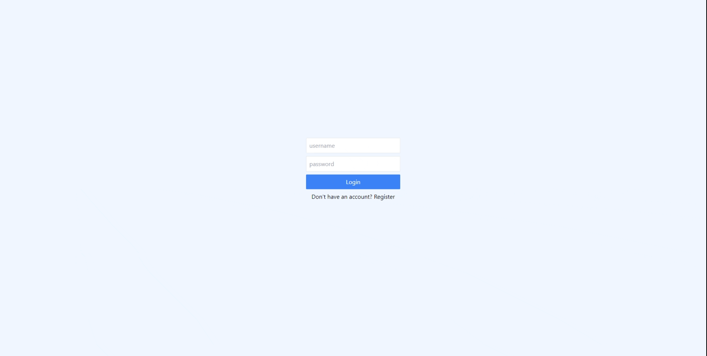

# **MERN MinglunChat** 
## :iphone: Modern Clean Chatting Experience

## <strong>LIVE DEMO IN PROGRESS</strong>


# <strong>What is this project?</strong>
This is a MERN(MongoDB, ExperssJS, ReactJS, NodeJS) chat app. It allows you to talk to people from all around the world with the press of a button. This is targeted towards students looking for a way to communicate with their peers at school with all the heavy restrictions on social media.


# <strong>Features</strong>

<ul>
<li>Secure Registration && Login</li>
<li>Darkmode/Lightmode Themes</li>
<li>Live Friend Requests</li>
<li>File/Image Attachment</li>
<li>Responsive Mobile View</li>
</ul>


# <strong>What I learned along the way!</strong>
This was really a test of my abilities, to get a full stack MERN Project up and running. In addition to solving a problem in my everyday life, I learned a lot from this experience. I secured my own knowledge of Mongo, Express and Node aswell as learning to use Web Sockets for live communication. 


# <strong>Get Started</strong>
Create .env File in your api directory
```
MONGO_URL="mongodb-connect-link"
JWT_SECRET="jwt-secret"
CLIENT_URL="url-to-client" (ex. http://localhost:5173/)
```

# Technologies

   